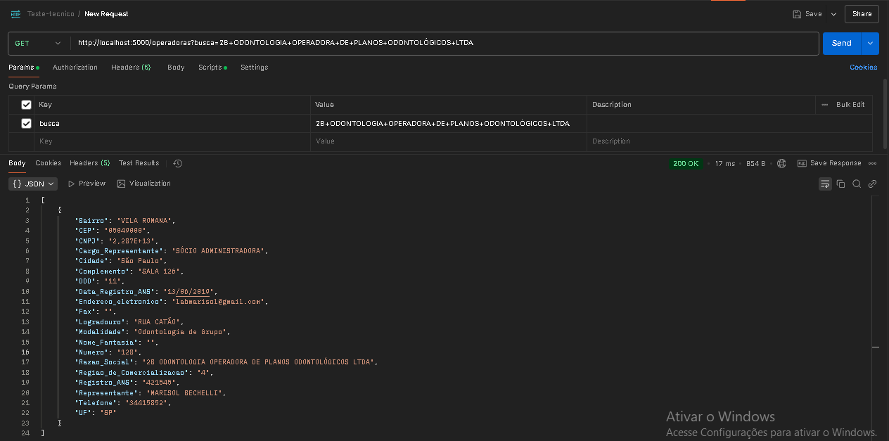
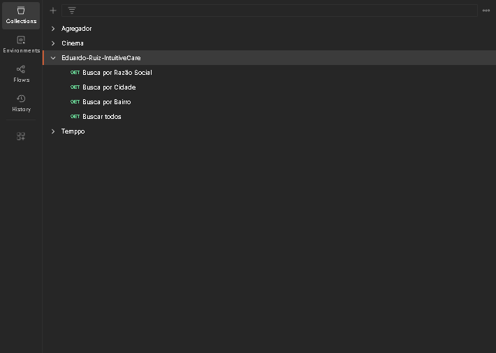

# Etapa 4 - Backend Teste Técnico IntuitiveCare

Este projeto é parte de um teste técnico para a IntuitiveCare.

## Pré-requisitos

- Sistema operacional: **Windows**
- Python 3.13 (incluído no diretório `python/`)

## Como executar o projeto

1. Navegue até a pasta raiz onde encontra-se o arquivo app.py.
2. Execute o projeto:
   ```bash
   python/python.exe app.py
   ```

## Execução

1. O servidor vai iniciar na porta 5000.
2. Ele terá o endpoint /operadoras
3. O endpoint terá um parâmetro chamado busca, e a partir dele você conseguirá fazer as consultas nos campos: Nome_Fantasia, Razao_Social, Regiao_de_Comercializacao, Modalidade, Cidade, UF, Bairro
4. A collection do Postman está na pasta resources.

## Prints de funcionamento
### Print do teste da requisição GET

### Print da Collection feita para consultas

